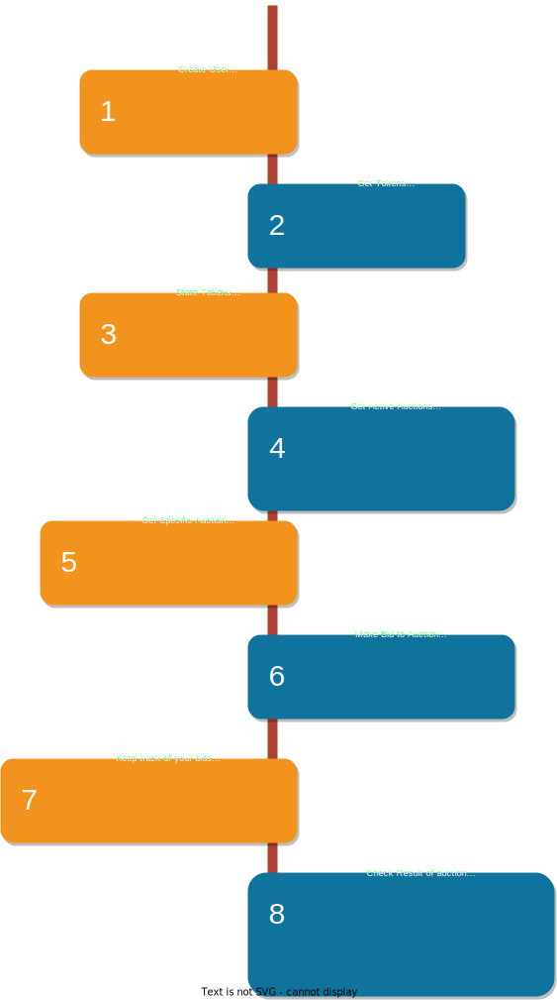

# Seller App

* It is browsable api made using django rest framework written in python language. It acts as a backend for application implementing live auction bidding features.
* It has power of django which makes it faster, scallable and secure.
* It is written in class based modal which makes understanding it's code easy and speedup the debugging process.
* It uses JWT (JSON WEB TOKEN) for verifying users.


## 🛠 Tools Used
Python, Django, Django-Rest-Framework, Djoser, drf-nestedrouters


## Deployment
   [Go to website](https://sellerappbackend.pythonanywhere.com/)
   
   ### DockerHub Repository
   https://hub.docker.com/repository/docker/henishpatel9045/sellerapp-django/


## API Reference

### 1. Register New User

```http
    POST /auth/users
    
    Returns newly created user.
```

##### Request Body
```json
{
    "email": "",
    "username": "",
    "password": ""
}
```

##### Response
```json
{
    "email": "fe@gmil.com",
    "username": "om",
    "id": 3
}
```

| Status Code | Description         |
| :-------- | :------- |
| **400 Bad Request**      | One or more validation fail. |
| **201 Created** | New User created Succefully. |

### 2. Update Existing User

```http
  PUT /auth/users/${id}
```

##### Request Body
```json
{
    "id": 2,
    "username": "henish",
    "email": "ompatel9045@gmail.com",
    "first_name": "Henish",
    "last_name": "Patel"
}
```

##### Response
```json
{
    "id": 2,
    "username": "henish",
    "email": "ompatel9045@gmail.com",
    "first_name": "Henish",
    "last_name": "Patel"
}
```

| Status Code | Description         |
| :-------- | :------- |
| **401 Unauthorised**      | If token is expired or not added to access-headers. |
| **200 OK** | User Update Successfully. |

### 3. Get Token

```http
  POST /auth/jwt/create
```

##### Request Body
```json
{
    "username": <USERNAME>,
    "password": <PASSWORD>
}
```

##### Response
```json
{
    "refresh": <YOUR_REFRESH_TOKEN>,
    "access": <YOUR_ACCESS_TOKEN>
}
```

```json
{
    "detail": "No active account found with the given credentials"
}
```

Access token is valid for 90 days.
Refresh token is valid for 100 days.

| Status Code | Description         |
| :-------- | :------- |
| **401 Unauthorised**      | If token is expired or not added to access-headers. |
| **200 OK** | User Update Successfully. |


### 4. Refresh Token

```http
  POST /auth/jwt/refresh
```

##### Request Body
```json
{
    "refresh": <YOUR_REFRESH_TOKEN>
}
```

##### Response
```json
{
    "refresh": <YOUR_REFRESH_TOKEN>,
    "access": <YOUR_ACCESS_TOKEN>
}
```

Access token is valid for 90 days.
Refresh token is valid for 100 days.

| Status Code | Description         |
| :-------- | :------- |
| **401 Unauthorised**      | If token is expired or not added to access-headers. |
| **200 OK** | User Update Successfully. |


### 5. Verify Access Token

```http
  POST /auth/jwt/create
```

##### Request Body
```json
{
    "token": <YOUR_ACCESS_TOKEN>
}
```

##### Response
```json
{
    "detail": "Token is invalid or expired",
    "code": "token_not_valid"
}
```

| Status Code | Description         |
| :-------- | :------- |
| **401 Unauthorised**      | If token is expired or not added to access-headers. |
| **200 OK** | User Update Successfully. |


### 6. Get Current User

```http
    GET /me
    
    Returns current user.
    Access Headers--
        Authorization: JWT <YOUR_ACCESS_TOKEN_HERE>
```
##### Response
```json
[
    {
        "user": 2,
        "first_name": "",
        "last_name": "",
        "total_bids": 1,
        "auction_win": 1,
        "phone_number": null,
        "country": null,
        "state": null,
        "date_created": "2022-07-16T13:34:56.894717+05:30",
        "last_updated": "2022-07-16T13:34:56.894717+05:30"
    }
]
```

| Status Code | Description         |
| :-------- | :------- |
| **400 Bad Request**      | If token is expired or not presenr in access-headers. |
| **200 OK** | Succefull |

### 7. Get Auctions List

```http
    GET /auctions
    
    Returns all auctions if user is administrator otherwise returns currently active auctions.
    Access Headers--
        Authorization: JWT <YOUR_ACCESS_TOKEN_HERE>
```
##### Response
```json
[
    {
        "id": 1,
        "title": "Camera`",
        "starting_price": "1000.00",
        "start_time": "2022-07-16T13:37:49+05:30",
        "end_time": "2022-08-16T13:51:00+05:30",
        "total_bids": 1,
        "user_won": 2,
        "final_bid_price": "2000.00"
    }
]
```

| Status Code | Description         |
| :-------- | :------- |
| **200 OK** | Succefull |

### 8. Make Bid to auction

```http
  POST /auctions/${auction_id}/bid/
```

##### Request Body
```json
{
    "auction": 1,
    "bid_amount": 1000.00
}
```

##### Response
```json
[
    {
        "id": 1,
        "auction": 1,
        "bid_amount": "2000.00"
    }
]
```

```json
{
    "error": "Bid amount must be greater than starting price of item."
}
```

```json
{
    "error": "Bid for this item is stopped."
}
```

| Status Code | Description         |
| :-------- | :------- |
| **406 Not Acceptable**      | If field fails validation. |
| **201 Created** | Bid posted Succefully. |


## Run Locally

Clone the project

```bash
  git clone https://github.com/henishpatel9045/sellerapp
```

Go to the project directory

```bash
  cd sellerapp
```

Install dependencies

```bash
  pip install -r req.txt
```

For Linux/MacOS
```bash
  pip3 install -r req.txt
```

Make Migrations

```bash
  py manage.py makemigrations
  py manage.py migrate
```

Create Superuser

```bash
  py manage.py createsuperuser
```

Start Server

```bash
  py manage.py runserver
```

## Application Flow



## Feedback

If you have any feedback, please reach out to us at henishpatel9045@gmail.com


## Authors

- [@henishpatel9045](https://www.github.com/henishpatel9045)


